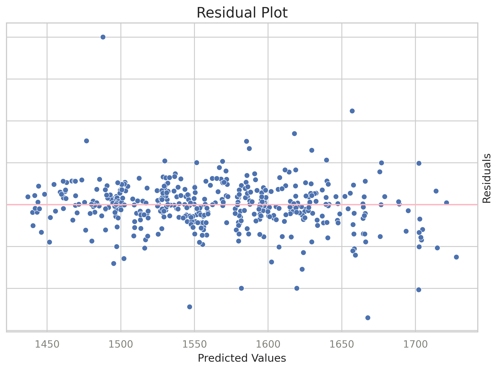
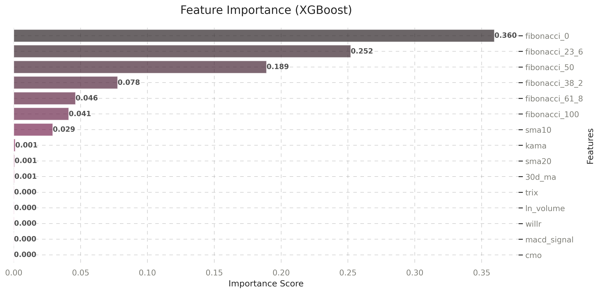

# Overview

# UNDER CONSTRUCTION 


### Project Focus:         
This project focuses on analyzing the price movements of MKR, the governance token of MakerDAO, using machine learning models. By identifying patterns and predicting the 1h close, I aim to provide valuable insights for investors and participants in the decentralized finance (DeFi) ecosystem.    

### MKR Overview:           
MakerDAO is a decentralized platform that enables users to generate DAI, a stablecoin pegged to the US dollar, by locking cryptocurrency as collateral. Unlike traditional financial systems, MakerDAO operates without a central authority, relying on smart contracts on the blockchain.   
MKR is the governance token of MakerDAO, meaning that its holders can vote on key decisions, such as risk management policies and system upgrades. MKR’s price fluctuates based on market demand, governance changes, and overall crypto market trends.  

      
### DAI Importance:         
* Stability is crucial for decentralized finance (DeFi) applications   
* DAI is created by locking collateral in MakerDAO smart contracts    
    
### Value of Predicting MKR Price:       
* MKR impacts the health of DAI and MakerDAO's protocol    
* Accurate predictions provide insights into market sentiment, governance decisions, and DAI stability    
* Beneficial for DeFi participants and investors       
           
### Prediction Target (y):       
* y represents  the closing price of MKR over consecutive time periods   
* It is calculated as:     
```bash
y = 'close'
```
    
* Continuous variable representing the close in MKR price     
    
          
### Importance of Analyzing Close:     
* Reveals patterns in MKR's volatility and behavior   
* Highlights MKR's impact on DAI stability and the MakerDAO ecosystem    
* Provides actionable insights for DeFi participants and investors    


     
# Features

### Crypto Data Fetcher:     
  * Retrieves OHLC data for selected cryptocurrencies and stablecoins using the Binance and Kraken API   
  * Includes additional derived metrics and timezone conversion        

### Feature Engineering:     
  * Creates various technical features and custom calculations     
  * Utilizes the TA-Lib library for advanced technical analysis    

### MKRUSDT Analysis:     
  * Focuses on the governance token MKR     
  * Examines factors influencing its price growth     
  * Uses machine learning models to predict the target variable (y)    

### Machine Learning Models:     
  * Implements models such as Linear Regression (LR), Decision Trees (DT), Random Forest (RF), and XGBoost    
  * Designed to predict MKR price trends      

### Flask:     
  * Included for programmatic interaction with the data     
  * Optional, suitable for deployment    

### Docker Support:      
  * A Dockerfile is provided for easy deployment in containerized environments      
 


# Datasets   
Crypto Data:      
[Link to Cryptocurrencies Binance Dataset](https://drive.google.com/file/d/1voYH8gYeAXWd2MIM7w4720hSbXBrOpdc/view?usp=sharing)    

[Link to Cryptocurrencies Kraken Dataset](https://drive.google.com/file/d/1ha7QAT9VKI43hVwTo3mZA23tKC6hQ0c9/view?usp=sharing)   

Merged Data with Features:     
[Link to merged Dataset](https://drive.google.com/file/d/1aImaDFQWnDEN1wliP5KTh2MwfqFSktEi/view?usp=sharing)    

  
 # Structure     

```bash
stable_coin/  
├── images/                                     # Contains the images that are generated through EDA     
│   ├── boxplot_mkr.png      
│   ├── correlation_matrix_mkr.png   
│   ├── distribution_price_change.png            
│   ├── timeseries_mkrusdt.png      
│   ├── timeseries_eur.png    
│   ├── price_change_correlation_with_volume.png 
├── README.md                      
├── notebook.ipynb/       
│   ├── get_coins                               # Fetches and processes cryptocurrency data     
│   ├── get_stocks                              # Fetches and processes stock data      
│   ├── feature engineering                     # Adds derived metrics for ML models      
│   ├── model evaluation and tuning             # Compares models and saves the best as a pickle file      
├── train.py                                    # Trains the best model            
├── predict.py                                  # Flask application for making predictions       
├── requirements.txt                            # List of required Python packages       
├── environment.yml                             # Conda environment file     
├── LICENSE      
├── Dockerfile                                  # For containerized deployment    
```

# Data Exploration:

Statistical Summary of MKR Price Data

Price Overview:   

The average closing price of MKR is approximately $1511, with a minimum of $880 and a maximum of $2411.
The price changes show a mean of -1.39% per day, with significant volatility ranging from -4.35% to +6.62% on any given day.    

Volatility and Market Behavior:    

The 7-day volatility ranges from 1.46% to 88.32%, indicating varying levels of market risk.
Intraday range shows small movements on average (mean of 1.29%) but can occasionally rise to 11.25%.   
   
Technical Indicators:
   
RSI (Relative Strength Index), a measure of price momentum, has a mean value of 48.7, suggesting a neutral market sentiment on average.
The ADX (Average Directional Index), which indicates trend strength, has an average of 27.9, meaning weak to moderate trends generally.
The MACD (Moving Average Convergence Divergence) fluctuates significantly, with values ranging from -66.7 to 473.2, signaling varying levels of momentum.

Growth Metrics:    

The 1-hour, 4-hour, and 72-hour growth metrics show a generally stable performance, with a slight positive growth observed over longer periods (mean around 1.0).       


## Correlation for MKRUSDT

     
Key observations:       
* Price Change Independence: `price_change` shows minimal correlation with all other features (values between -0.01 and 0.04), indicating it's relatively independent of other market indicators  
* High Multicollinearity Group: There's extremely high correlation (≈1.0) between `close`, `open`, and `7d_ma`, suggesting redundant information that could lead to model instability  
*#* Medium Correlation Group: `atr` shows moderate to strong correlation (0.59-0.62) with price levels (`close`, `open`, `7d_ma`, `30d_ma`), indicating its close relationship with recent price action
* Technical Indicator Relationships: `rsi` has notable correlation with growth metrics (`growth_4h`: 0.58, `growth_72h`: 0.54), suggesting these features capture similar market momentum patterns
* Volume Metrics: `volume_change` shows minimal correlation with other features, making it a potentially valuable independent signal  
 
      

## Boxplot for Closing Prices for MKRUSDT
     
Key observations:       
* Interquartile range (IQR) spans from Q1 = 1288.0 to Q3 = 1668.0, representing the middle 50% of closing prices
* Median close price appears to be around the center of the IQR, indicating a relatively symmetric distribution
* Presence of outliers beyond the upper whisker (above ≈ 2200) suggests occasional price spikes
* Lower whisker extends towards ≈ 900-1000, indicating a historical lower price range
* Distribution suggests that while the majority of prices are within a stable range, significant upward price jumps have occurred, which could be relevant for volatility analysis    
        
        
               
## Timeseries for MKRUSDT and DAIUSD

 
Key observations for MKRUSDT:  
* Over the last 180 days, MKRUSDT exhibited high volatility
* Price peaked in December 2024, surpassing 2400 USDT, followed by a strong decline
* Continuous downtrend can be observed from January 2025, stabilizing around 1000 USDT in February
* This suggests a period of strong speculative movement, followed by a bearish correction
     
          
         
  
         
     
Key observations for DAIUSD:       
* Being a stablecoin, maintained a price close to 1.0000 USDT
* Occasional spikes above 1.0025 USDT indicate temporary deviations from the peg
* Increased volatility was observed in early February 2025, possibly due to liquidity shifts or market events
* Overall, the price remained within an expected range, reinforcing its stability
   
  
## Distribution of Price Change for MKRUSDT
       
    
Key observations:    
* Distribution appears unimodal with a peak around 1600 USDT.
* There is a slight right skew, indicating that higher price values occur but are less frequent.
* The KDE (kernel density estimate) smooths the distribution and highlights key trends. 

# Machine Learning Models
  
  
## Target Variable Analysis: y    
Mean y: 0.0557  
Standard Deviation y: 5.3460  
 
Key observation:
* Illustrates the frequency distribution of the target variable y across the Train, Validation, and Test datasets  
* Majority of values concentrated near 0  
* Extreme outliers present, with some values exceeding 5000 
* Distribution is highly skewed, with most values in a small range and a few significantly larger ones  
* Extreme outliers may adversely affect the model by increasing error and reducing prediction accuracy 
* Skewness suggests the model might face difficulty in accurately predicting y   
   
 
Key observations:
* Interquartile Range (IQR) is small, suggesting that most data points are closely clustered   
* Numerous strong outliers exceed 1000    
* This aligns with the histogram: the majority of values are small, with a few extreme values   
* These outliers can significantly distort metrics like MSE and RMSE during training and validation   
* Next Step: further analysis to decide whether to remove or transform the outliers  
  

## Linear Regression (LR)   
   
   
* Features `ppo`, `trix`, `atr` show positive accuracy drop, meaning removing these features decreases model accuracy   
* Features like `sma20`, `cci`, and `roc` show negative accuracy drop, meaning removing these features could improves model accuracy  
* Various features have no influence on the accuracy and could be considered for removal   
    
   
Key Observations:     
* Most predictions are centered around 0, with a sharp peak and minimal spread
* Indicates that the model is predicting a narrow range of values, which could suggest underfitting or that the target variable has a limited variance         
      
   
## Decision Trees (DT)   
       
    

Key observations:  
* Higher values for min_samples_leaf (13-15) yield better results, with MSE around 12.9
* max_depth has minimal impact, with stable MSE across depths, except for min_samples_leaf=1, where a significant deterioration occurs at depth=4 (MSE spikes to ~34)
* Optimal Configuration: max_depth=4, min_samples_leaf=13, achieving an MSE of 12.9
* Interpretation: The model benefits from higher leaf sample restrictions, preventing overfitting    
   
 
## Random Forest (RF)   

    
Key observations: 
* Best number of trees (n_estimators): 180, achieving an MSE of ~2900.731
* Best max_depth: 10, balancing between underfitting (depth=5) and overfitting (depth=15)     
* Best min_samples_leaf: 1, enabling the model to capture detailed patterns
* Final model performance: MSE: 2870.841, RMSE: 53.580, R² Score: 0.085 
* While RMSE is reasonable, the low R² score (8.5%) indicates the model has limited explanatory power        
      

Key observations:
* The residuals (in log scale) are mostly clustered around zero, indicating accurate model predictions in this scale   
* A few residuals deviate from zero, suggesting areas where the model struggles with accuracy  
* No clear pattern in the residuals, indicating that the model is well-calibrated in the log scale   
* Despite the well-calibrated residuals in the log scale, the low R² suggests that the model’s explanatory power remains limited  
     

## XGBoost     
   
    
Key observations:      
* Majority of points cluster around the diagonal (pink dashed line), indicating model predictions generally align with actual values   
* Strong linear relationship between predicted and actual values, suggesting the model captures underlying patterns well   
* Most data points are concentrated around the 0 value on both axes   
* Data spans from approximately -2 to 6 on both axes, with sparse points in higher value ranges (4-6)   
* Some outliers visible, particularly around (-2, 0) and (6, 0)   
* Slight tendency to underpredict at extreme values   
* Sparsity at higher values: Indicates less reliable predictions in these ranges   
* Generating more training data for extreme value ranges (4-6) could improve model reliability in these areas  


    
Key observations:    
* Dominant Features: Technical indicators like `trix`, `roc`, `ppo`, `cmo`, `cci`, and `bop` dominate, suggesting strong predictive power for 1-hour predictions   
* Time-Based Features: `hour`, `day`, `month`, and `year` show very low importance, indicating that price movements are more influenced by technical factors than by time (but consider the short time-frame of 3m)   
* Cross-Crypto Correlation: Most cryptocurrency tickers (e.g., `BTCUSDT`, `ETHUSDT`) have minimal impact, showing limited cross-crypto correlation in 1-hour predictions   
* Traditional Market Indicators: Indicators like `^SPX` and `^VIX` show low importance, with limited correlation to traditional markets   
* Fibonacci Levels: Surprisingly low importance across all timeframes, despite their common use in technical analysis   
* Focusing on technical indicators is more valuable than time-based or cross-crypto features, while traditional market indicators and Fibonacci levels have limited predictive power  
   
So I considered model simplification by focusing on top 10-15 features and looked at SHAP
   
   

Key observations:     
* SHAP Analysis: Provides insight into how individual feature values influence predictions   
* Each dot represents a data point, with color indicating feature value (blue = low, red = high)   
* For "price_change", high values (red dots) positively push predictions, while low values (blue dots) negatively influence them   
* Features like `cci` and `roc` exhibit a mix of positive and negative effects, suggesting non-linear relationships with the target variable   
* Features with narrow SHAP value distributions, like `day` or `ln_volume`, have a limited effect on predictions across the dataset   

### Retraining Result:
Surprisingly, retraining the model with the most important features resulted in lower scores 

## The best model is:  
### XGBoost 
* **Best Hyperparameters:**  
  * **eta                 0.250000**   
  * **max_depth           5.000000**   
  * **min_child_weight    1.000000**   
  * **rmse                1.467122**  
* * **MSE on the Validation Set: 2.1524**  
* * **MAE on the Validation Set: 0.0163**   
* * **R² Score on the Validation Set: 0.9247**   
 


# Installation
  * Clone the repository:
```bash
  git clone https://github.com/your-repo.git
  cd your-repo
  ```
  * Set up the environment
  Using Conda:
```bash
  conda env create -f environment.yml
  conda activate your-environment-name
  ```
  * Using pip:
```bash
  pip install -r requirements.txt
  ```

## Installation Instructions for TA-Lib
* TA-Lib library is required for this project but is not installed automatically via the environment.yaml file   
* You need to install it manually due to potential platform-specific compilation requirements    

### To install TA-Lib, follow these steps:    

  * Using Conda (Recommended):   

```bash
conda install -c conda-forge ta-lib
```

* Using pip: If you prefer pip, ensure you have the required dependencies installed and run:    

```bash
pip install TA-Lib
```
  
  * On macOS with Homebrew: First, install the TA-Lib C library:

```bash
brew install ta-lib
```
  * Then install the Python wrapper:

```bash
pip install TA-Lib
```

* On Linux: Install the required development library (e.g., for Ubuntu):

```bash
sudo apt-get install libta-lib-dev
```
  * Then install the Python wrapper:

```bash
pip install TA-Lib
```

* On Windows: Download and install the precompiled binaries for your system from the TA-Lib website, then install the Python wrapper:

```bash
pip install TA-Lib
```

**Make sure TA-Lib is installed before running the application. If you encounter any issues, refer to the TA-Lib documentation for further assistance**


        
# How to Use

* **Jupyter Notebook (notebook.ipynb):**
  * Fetch cryptocurrency and stock market data:
    * Fetches data for cryptocurrencies and stablecoins defined in the coins list.
    * Processes the data and adds derived metrics (e.g., price change).
    * Saves the final dataset as `stable_coins.csv`.
  * Fetch hourly stock data for predefined tickers:
    * Adds derived metrics.
    * Formats timestamps.
    * Combines all stock data into a single DataFrame and saves it as a CSV.
    * Logs missing or delisted stocks/cryptos as warnings or errors.
  * Perform feature engineering and derive metrics.
  * Evaluate multiple machine learning models.
  * Save the best models as `.pkl` files.

* **Train the Model:**
  * Use `train.py` to train the best-performing model (default: XGBoost) on the processed data.
  * Save the trained model as a `.pkl` file.

* **Deploy the Model with Flask:**
  * Use `predict.py` to deploy the model and provide predictions via Flask.


# Flask
* The repository includes a Flask (`predict.py`) to interact with the trained XGBoost model. The API allows users to predict the 'close' within the next hour.

* **Steps to Use:**       
  * Start the Flask Server   
  * Ensure the conda environment is active and run:      
```bash
    python predict.py --port=<PORT>
```
  * Replace <PORT> with the desired port number (e.g., 5001). If no port is specified, the server defaults to port 8000            
    
  * Example:     
```bash
    python predict.py --port=5001
```  
  * The server runs at http://0.0.0.0:, for example: http://0.0.0.0:5001       

     
  **Make Predictions**      
  * Send an HTTP POST request with the input features as JSON to the /predict endpoint. Replace <PORT> with the port you specified earlier      

  * Example Input:    
```bash
curl -X POST http://127.0.0.1:5001/predict \
-H "Content-Type: application/json" \
-d '{"ln_volume": -25.422721545090816, "bop": -0.44444, "ppo": 1.0097517730496455}'
```
  * Example Response:  
```bash
{
  "predicted_growth_rate": -0.002064734697341919
}
```

# Run with Docker
* To simplify deployment, a Dockerfile is provided. To build and run the Docker container:


* Build the Docker image:
```bash
docker pull continuumio/anaconda3
docker build -t mkr-coin-analysis .
```


* Run the container:
```bash
docker run -p 5001:5001 mkr-coin-analysis
```

    
## License
This project is open-source and licensed under the MIT License.