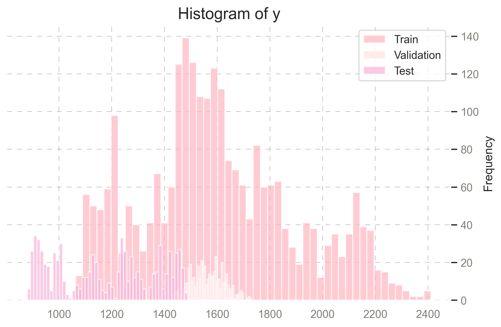
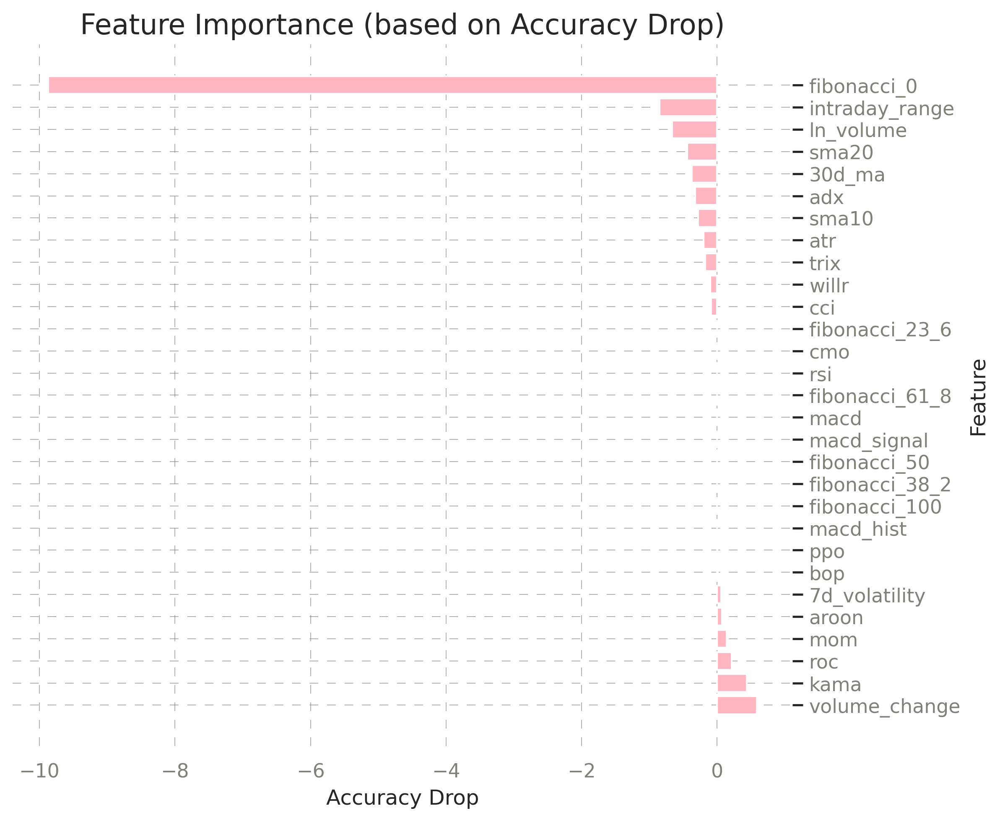

# Overview
   
### Project Focus:         
This project focuses on analyzing the price movements of MKR, the governance token of MakerDAO, using machine learning models.      
By identifying patterns and predicting the 1h close, I aim to provide valuable insights for investors and participants in the decentralized finance (DeFi) ecosystem.    

### MKR Overview:           
MakerDAO is a decentralized platform that enables users to generate DAI, a stablecoin pegged to the US dollar, by locking cryptocurrency as collateral.      
Unlike traditional financial systems, MakerDAO operates without a central authority, relying on smart contracts on the blockchain.   
MKR is the governance token of MakerDAO, meaning that its holders can vote on key decisions, such as risk management policies and system upgrades. MKR’s price fluctuates based on market demand, governance changes, and overall crypto market trends.  

      
### DAI Importance:         
* Stability is crucial for decentralized finance (DeFi) applications   
* DAI is created by locking collateral in MakerDAO smart contracts    
    
### Value of Predicting MKR Price:       
* MKR impacts the health of DAI and MakerDAO's protocol    
* Accurate predictions provide insights into market sentiment, governance decisions, and DAI stability    
* Beneficial for DeFi participants and investors       
           
### Prediction Target (y):       
* y represents  the closing price of MKR over consecutive time periods   
* It is calculated as:     
```bash
y = 'close'
```
    
* Continuous variable representing the close in MKR price     
    
          
### Importance of Analyzing Close:     
* Reveals patterns in MKR's volatility and behavior   
* Highlights MKR's impact on DAI stability and the MakerDAO ecosystem    
* Provides actionable insights for DeFi participants and investors    


     
# Features

### Crypto Data Fetcher:     
  * Retrieves OHLC data for selected cryptocurrencies and stablecoins using the Binance and Kraken API   
  * Includes additional derived metrics and timezone conversion        

### Feature Engineering:     
  * Creates various technical features and custom calculations     
  * Utilizes the TA-Lib library for advanced technical analysis    

### MKRUSDT Analysis:     
  * Focuses on the governance token MKR     
  * Examines factors influencing its price growth     
  * Uses machine learning models to predict the target variable (y)    

### Machine Learning Models:     
  * Implements models such as Linear Regression (LR), Decision Trees (DT), Random Forest (RF), and XGBoost    
  * Designed to predict MKR price trends      

### Flask:     
  * Included for programmatic interaction with the data     
  * Optional, suitable for deployment    

### Docker Support:      
  * A Dockerfile is provided for easy deployment in containerized environments      
 


# Datasets   
Crypto Data:      
[Link to Cryptocurrencies Binance Dataset](https://drive.google.com/file/d/1voYH8gYeAXWd2MIM7w4720hSbXBrOpdc/view?usp=sharing)  

[Link to Cryptocurrencies Kraken Dataset](https://drive.google.com/file/d/1ha7QAT9VKI43hVwTo3mZA23tKC6hQ0c9/view?usp=sharing)

Merged Data with Features:     
[Link to merged Dataset](https://drive.google.com/file/d/1aImaDFQWnDEN1wliP5KTh2MwfqFSktEi/view?usp=sharing)   

  
 # Structure     

```bash
stable_coin/  
├── images/                                     # Contains the images that are generated     
│   ├── boxplot_mkr.png      
│   ├── correlation_matrix_mkr.png   
│   ├── cross_validation_mse_vs_max_depth_dt.png
│   ├── distribution_close.png
│   ├── feature_importance_on_accuracy_drop.png 
│   ├── feature_importance_xgboost.png 
│   ├── heatmap_dt.png 
│   ├── mse_heatmap_rf.png 
│   ├── mse_vs_max_depth_dt.png 
│   ├── mse_vs_num_trees_diff_max_depth_rf.png 
│   ├── mse_vs_num_trees_diff_min_samples_rf.png  
│   ├── mse_vs_num_trees_rf.png  
│   ├── predicted_values_distribution_lr.png  
│   ├── price_change_correlation_with_volume.png   
│   ├── residuals_distribution_lr.png  
│   ├── residuals_rf.png   
│   ├── residuals_vs_predicted.png 
│   ├── rmse_vs_max_depth_for_diff_eta.png   
│   ├── scatter_actual_vs_predicted_rf.png 
│   ├── shap_bar_plot_xgboost.png 
│   ├── shap_beeswarm_plot_xgboost.png     
│   ├── timeseries_mkrusdt.png     
│   ├── timeseries_daiusdt.png  
│   ├── timeseries_eur.png    
│   ├── y_boxplot.png 
│   ├── y_histogram.png 
├── README.md                      
├── notebook.ipynb/       
│   ├── get_coins                               # Fetches and processes cryptocurrency data       
│   ├── EDA                                     # EDA on MKRUSDT
│   ├── feature engineering                     # Adds derived metrics for ML models      
│   ├── model evaluation and tuning             # Compares models and saves the best as a pickle file      
├── train.py                                    # Trains the best model            
├── predict.py                                  # Flask application for making predictions       
├── requirements.txt                            # List of required Python packages       
├── environment.yml                             # Conda environment file     
├── LICENSE      
├── Dockerfile                                  # For containerized deployment    
```

# Statistical Summary of MKR Price Data:

### Price Trends:
* The average closing price is $1511.79, with a high of $2411.00 and a low of $880.00
* The 7-day and 30-day moving averages are nearly identical, suggesting a stable trend over the period  
   
### Volatility & Price Changes:
* 7-day volatility is relatively high (Mean: 12.72, Max: 88.32), indicating price fluctuations
* Intraday price movements are small on average (1.29%), but can spike up to 11.25%
* Price change distribution shows a slight negative bias (Mean: -0.0139), with extreme moves ranging from -4.35% to +6.61%
   
### Market Momentum & Strength:
* ADX (Average Directional Index) is 27.86, indicating moderate trend strength, but can reach as high as 82.55
* RSI (Relative Strength Index) is 48.70 on average, suggesting neutral momentum, but it ranges from 15.72 (oversold) to 97.19 (overbought)

### MACD Analysis:
* The MACD mean is slightly positive (1.06), but its large standard deviation suggests high variability  
* The MACD histogram shows an overall negative bias (-0.55), indicating weak momentum 

### Short- & Long-Term Growth:
* 1h and 4h growth rates hover around neutral (≈1.00), with minor fluctuations
* 72h growth shows greater variation (0.7896 to 1.4076), indicating potential medium-term trends      

     
## Correlation for MKRUSDT

     
Key observations:       
* Price Change Independence: `price_change` shows minimal correlation with all other features (values between -0.01 and 0.04), indicating it's relatively independent of other market indicators  
* High Multicollinearity Group: There's extremely high correlation (≈1.0) between `close`, `open`, and `7d_ma`, suggesting redundant information that could lead to model instability  
* Medium Correlation Group: `atr` shows moderate to strong correlation (0.59-0.62) with price levels (`close`, `open`, `7d_ma`, `30d_ma`), indicating its close relationship with recent price action
* Technical Indicator Relationships: `rsi` has notable correlation with growth metrics (`growth_4h`: 0.58, `growth_72h`: 0.54), suggesting these features capture similar market momentum patterns
* Volume Metrics: `volume_change` shows minimal correlation with other features, making it a potentially valuable independent signal  
 
      

## Boxplot for Closing Prices for MKRUSDT
       
     
Key observations:       
* Interquartile range (IQR) spans from Q1 = 1288.0 to Q3 = 1668.0, representing the middle 50% of closing prices
* Median close price appears to be around the center of the IQR, indicating a relatively symmetric distribution
* Presence of outliers beyond the upper whisker (above ≈ 2200) suggests occasional price spikes
* Lower whisker extends towards ≈ 900-1000, indicating a historical lower price range
* Distribution suggests that while the majority of prices are within a stable range, significant upward price jumps have occurred, which could be relevant for volatility analysis       
        
               
## Timeseries for MKRUSDT and DAIUSD

 
Key observations for MKRUSDT:  
* Over the last 180 days, MKRUSDT exhibited high volatility
* Price peaked in December 2024, surpassing 2400 USDT, followed by a strong decline
* Continuous downtrend can be observed from January 2025, stabilizing around 1000 USDT in February
* This suggests a period of strong speculative movement, followed by a bearish correction
     
          
         
  
         
     
Key observations for DAIUSD:       
* Being a stablecoin, maintained a price close to 1.0000 USDT
* Occasional spikes above 1.0025 USDT indicate temporary deviations from the peg
* Increased volatility was observed in early February 2025, possibly due to liquidity shifts or market events
* Overall, the price remained within an expected range, reinforcing its stability
   
  
## Distribution of Close for MKRUSDT
       
    
Key observations:    
* Bimodal distribution with main peak at 1500-1600 USDT   
* Secondary peak around 1200 USDT, right-skewed with tail extending to 2400    
* Majority of price action concentrated between 1400-1800 USDT range    

# Machine Learning Models
  
  
## Target Variable Analysis: y    
Mean y: 1562.8944    
Standarddeviation y: 62.9891      

 
Key observation:
* Illustrates the frequency distribution of the target variable y across the Train, Validation, and Test datasets  
* Range: Values spread from ~1000 to 2400
* Main concentration: Highest density around 1400-1600
* Shape: Right-skewed distribution (longer tail towards higher values)
* Dataset splits show similar patterns across train/validation/test
 
   
 
Key observations:
* Training Set: widest spread of values, shows several outliers (dots above box), median around 1500, larger variability compared to other sets
* Validation Set: more compact distribution, fewer outliers, similar median to training set, more consistent/stable values
* Test Set: lower median compared to train/validation, smaller spread, few outliers, suggests slightly different market conditions 
  

## Linear Regression (LR)  

Mean Squared Error (MSE) on reduced Validation Set: 173.01   
Mean Absolute Error (MAE) on reduced Validation Set: 8.57   
R-squared (R²) on reduced Validation Set: 0.96    

   
   
* Fibonacci_0 has the most significant impact on model accuracy with an accuracy drop of nearly -10 when removed
* Other important features include intraday_range and ln_volume
* Most Fibonacci-based features (23.6, 38.2, 50, 100) show minimal impact, suggesting they could be removed to simplify the model without
significant performance loss
* Technical indicators like RSI, MACD have surprisingly low importance 
    
   
Key Observations:     
* Distribution of predictions spans 1450-1700, with most values between 1500-1650
* Multi-modal distribution suggests distinct price levels or regimes in the data
* Relatively few predictions at extreme values (1450 or 1700) indicates the model is conservative in predicting extreme prices
* Irregular shape suggests the underlying price movements aren't normally distributed, which is typical for financial data       
      
   
## Decision Trees (DT)   
Best Hyperparameters:
max_depth            10.00000    
min_samples_leaf     24.00000    
mse                 205.15055   
Decision Tree Regressor MSE on the validation set: 205.151    
Decision Tree Regressor R2 Score on the validation set: 0.948    


    

Key observations:  
* Strong inverse relationship between max_depth and MSE
* MSE decreases significantly as max_depth increases from 1.0 to 4.0
* Different min_samples_leaf values show very similar performance curves
* Deeper trees (max_depth=4.0) provide best predictive performance
* Further increasing max_depth likely risks overfitting
* Simple configuration with min_samples_leaf=1 sufficient for good results   
   
 
## Random Forest (RF)   
Validation MSE: 194.431    
RMSE: 13.944     
R² Score: 0.951     

    
Key observations: 
* min_samples_leaf=10 shows best performance (lowest MSE ~195)
* Higher min_samples_leaf values provide more stable learning curves
* Smaller leaf sizes (1-3) show higher variance and worse performance
* Clear separation between different leaf sizes indicates this is a crucial parameter       
      

Key observations:
* Points roughly symmetrically scattered around zero line (red)
* No clear funnel or megaphone pattern suggests homoscedasticity
* Most residuals appear within reasonable bounds (-2 to +2)
* Consistent variance across all predicted values (1450-1700), with few outliers present, particularly in higher prediction ranges
* No systematic bias visible (even distribution above/below zero)
* Slight heteroscedasticity at extreme values (1450 and 1700)
* Some notable outliers around 1500 and 1650 prediction ranges
* Denser point concentration in 1500-1600 range suggests more training data here


## XGBoost     
Best Hyperparameters:
eta                  0.150000   
max_depth            4.000000   
min_child_weight    10.000000   
rmse                13.602891   

XGBoost MSE on the Validation Set: 185.0386    
XGBoost MAE on the Validation Set: 9.2880    
XGBoost R² Score on the Validation Set: 0.9534   
     
    
Key observations:      
* Very strong linear relationship (R² likely >0.95)
* Points cluster tightly around ideal prediction line
* Slight heteroscedasticity - spread increases at higher values
* Few outliers, mostly in upper value range (>1650), more uncertainty in predictions above 1650
* Model maintains accuracy across entire value range
* No systematic bias (points evenly distributed above/below line)
* Slight tendency to underestimate extreme high values
* Very reliable predictions in middle range (1500-1600)
* No evidence of overfitting or underfitting  


    
Key observations:    
* Most influential features are Fibonacci levels, especially `fibonacci_0`, `fibonacci_23_6`, 
and `fibonacci_50`, which dominate the model’s decisions
* Traditional indicators like moving averages (`sma10`, `sma20`) and volume-based indicators have minimal impact, suggesting they may not add much predictive power
* This insight could be used to refine feature selection, possibly reducing dimensionality and improving model efficiency
   

   
   

Key observations:     
* fibonacci_0 dominates with highest impact (~150 magnitude)
* Fibonacci retracement levels are strongest predictors
* Secondary group (fibonacci_23_6, fibonacci_50, sma10) shows moderate impact (20-40)
* Simple moving averages outperform complex indicators
* Many common technical indicators have negligible predictive power
* Most technical indicators (MACD, ATR, CCI etc.) show minimal impact (<5)
* Model heavily relies on basic price action vs technical analysis


## The best model is:  

XGBoost MSE on the Validation Set: 185.0386     
XGBoost MAE on the Validation Set: 9.2880     
XGBoost R² Score on the Validation Set: 0.9534      
     
Best Hyperparameters:    
eta                  0.150000    
max_depth            4.000000    
min_child_weight    10.000000    
rmse                13.602891    

 


# Installation
  * Clone the repository:
```bash
  git clone https://github.com/your-repo.git
  cd your-repo
  ```
  * Set up the environment
  Using Conda:
```bash
  conda env create -f environment.yml
  conda activate your-environment-name
  ```
  * Using pip:
```bash
  pip install -r requirements.txt
  ```

## Installation Instructions for TA-Lib
* TA-Lib library is required for this project but is not installed automatically via the environment.yaml file   
* You need to install it manually due to potential platform-specific compilation requirements    

### To install TA-Lib, follow these steps:    

  * Using Conda (Recommended):   

```bash
conda install -c conda-forge ta-lib
```

* Using pip: If you prefer pip, ensure you have the required dependencies installed and run:    

```bash
pip install TA-Lib
```
  
  * On macOS with Homebrew: First, install the TA-Lib C library:

```bash
brew install ta-lib
```
  * Then install the Python wrapper:

```bash
pip install TA-Lib
```

* On Linux: Install the required development library (e.g., for Ubuntu):

```bash
sudo apt-get install libta-lib-dev
```
  * Then install the Python wrapper:

```bash
pip install TA-Lib
```

* On Windows: Download and install the precompiled binaries for your system from the TA-Lib website, then install the Python wrapper:

```bash
pip install TA-Lib
```

**Make sure TA-Lib is installed before running the application. If you encounter any issues, refer to the TA-Lib documentation for further assistance**


        
# How to Use

* **Jupyter Notebook (notebook.ipynb):**
  * Fetch cryptocurrency data:
    * Fetches data for cryptocurrencies and stablecoins defined in the coins list
    * Logs missing or delisted cryptos as warnings or errors
    * Processes the data and adds derived metrics (e.g., price change)
    * Saves the final dataset as `one_df.csv`
  * Perform feature engineering and derive metrics
  * Evaluate multiple machine learning models
  * Save the best models as `.pkl` files

* **Train the Model:**
  * Use `train.py` to train the best-performing model (default: XGBoost) on the processed data
  * Save the trained model as a `.pkl` file

* **Deploy the Model with Flask:**
  * Use `predict.py` to deploy the model and provide predictions via Flask


# Flask
* The repository includes a Flask (`predict.py`) to interact with the trained XGBoost model. The API allows users to predict the 'close' within the next hour.

* **Steps to Use:**       
  * Start the Flask Server   
  * Ensure the conda environment is active and run:      
```bash
    python predict.py --port=<PORT>
```
  * Replace <PORT> with the desired port number (e.g., 5001). If no port is specified, the server defaults to port 8000            
    
  * Example:     
```bash
    python predict.py --port=5001
```  
  * The server runs at http://0.0.0.0:, for example: http://0.0.0.0:5001       

     
  **Make Predictions**      
  * Send an HTTP POST request with the input features as JSON to the /predict endpoint. Replace <PORT> with the port you specified earlier      

  * Example Input:    
```bash
curl -X POST http://127.0.0.1:5001/predict \
-H "Content-Type: application/json" \
-d '{"ln_volume": 8.573291254393968, "bop": -0.75, "ppo": 1.6623794774736873}'
```
  * Example Response:  
```bash
{
"predicted_close_price": 1098.2784423828125
}
```

# Run with Docker
* To simplify deployment, a Dockerfile is provided. To build and run the Docker container:


* Build the Docker image:
```bash
docker build -t mkr-coin-analysis .
```


* Run the container:
```bash
docker run -p 5001:5001 mkr-coin-analysis
```

    
## License
This project is open-source and licensed under the MIT License.