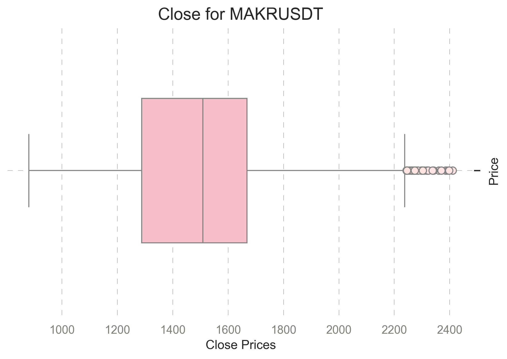
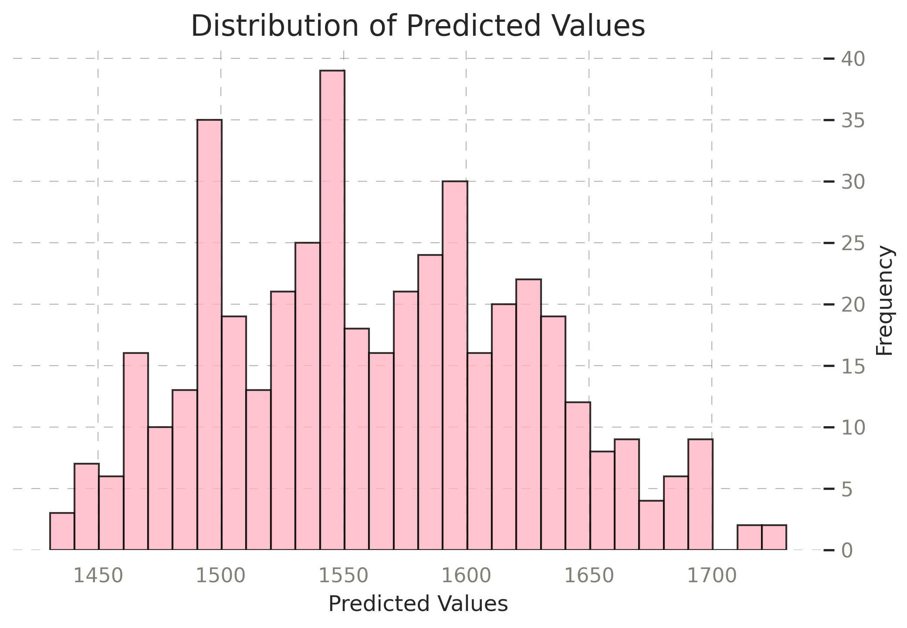
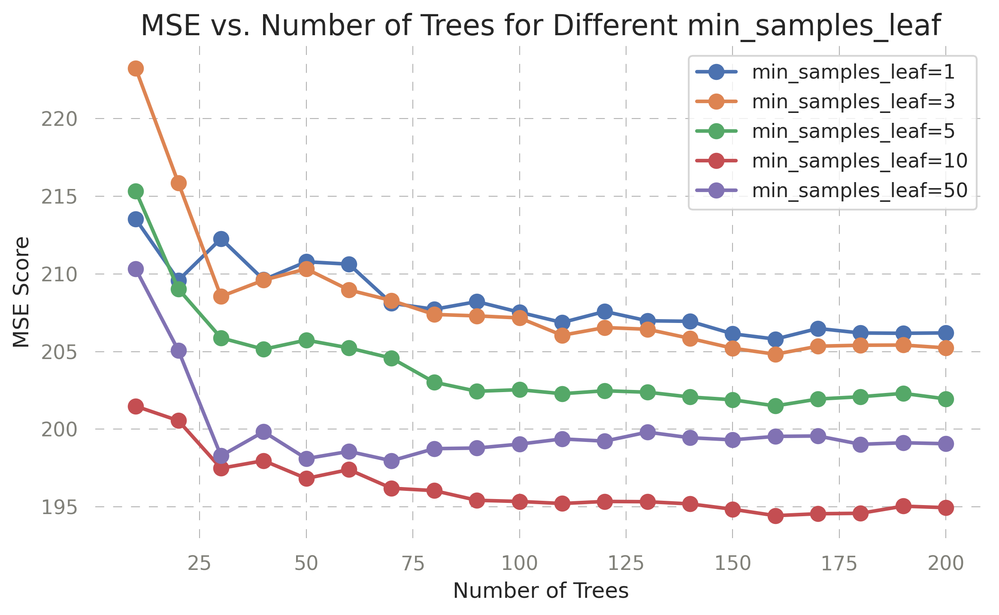

# Overview

* **Project Focus:**     
  * Analyze MKR price volatility and predict its price changes using machine learning models       
    
* **MKR Overview:**       
  * Native governance token of the MakerDAO ecosystem   
  * MakerDAO supports DAI, a decentralized stablecoin pegged to the US dollar   
  * MKR holders influence decision-making within the ecosystem   
      
* **DAI Importance:**     
  * Stability is crucial for decentralized finance (DeFi) applications   
  * DAI is created by locking collateral in MakerDAO smart contracts    
    
* **Value of Predicting MKR Price:**   
  * MKR impacts the health of DAI and MakerDAO's protocol    
  * Accurate predictions provide insights into market sentiment, governance decisions, and DAI stability    
  * Beneficial for DeFi participants and investors       
           
**Prediction Target (y):**  
  * y represents the percentage change in the closing price of MKR over consecutive time periods   
  * It is calculated as:     
```bash
y = (close - close_lag_1) / close_lag_1
```
   
  * close: Closing price of MKR at the current time step  
  * close_lag_1: Closing price of MKR at the previous time step  
  * Continuous variable representing the relative change in MKR price    
  * Positive values = price increase; negative values = price decrease   
  * Values expressed as decimals (e.g., 0.05 = 5% increase, -0.03 = 3% decrease)    
        
**Why Use Percentage Change:**     
  * Normalizes price movements, reducing sensitivity to absolute price levels    
  * Captures relative price movements, essential for understanding volatility and predicting trends in a highly volatile asset like MKR  
          
**Importance of Analyzing Percentage Change:**    
  * Reveals patterns in MKR's volatility and behavior   
  * Highlights MKR's impact on DAI stability and the MakerDAO ecosystem    
  * Provides actionable insights for DeFi participants and investors    


     
# Features

**Crypto Data Fetcher:**    
  * Retrieves OHLC data for selected cryptocurrencies and stablecoins using the Binance and Kraken API   
  * Includes additional derived metrics and timezone conversion    

**Stock Data Fetcher:**  
  * Fetches hourly stock data for predefined tickers using Yahoo Finance     
  * Enriches data with calculated metrics     

**Feature Engineering:**  
  * Creates various technical features and custom calculations     
  * Utilizes the TA-Lib library for advanced technical analysis    

**MKRUSDT Analysis:**  
  * Focuses on the governance token MKR     
  * Examines factors influencing its price growth     
  * Uses machine learning models to predict the target variable (y)    

**Machine Learning Models:**  
  * Implements models such as Linear Regression (LR), Decision Trees (DT), Random Forest (RF), and XGBoost    
  * Designed to predict MKR price trends      

**Flask:**  
  * Included for programmatic interaction with the data     
  * Optional, suitable for deployment    

**Docker Support:**  
  * A Dockerfile is provided for easy deployment in containerized environments      
 


# Datasets  
Crypto Data:      
[Link to Cryptocurrencies Binance Dataset](https://drive.google.com/file/d/1voYH8gYeAXWd2MIM7w4720hSbXBrOpdc/view?usp=sharing)    

[Link to Cryptocurrencies Kraken Dataset](https://drive.google.com/file/d/1ha7QAT9VKI43hVwTo3mZA23tKC6hQ0c9/view?usp=sharing)   

Stock Data:    
[Link to Stocks Dataset](https://drive.google.com/file/d/1d4PRGApTcuQaCAj16dOc9k79P3M2PaYF/view?usp=sharing)   

Merged Data with Features:     
[Link to merged Dataset](https://drive.google.com/file/d/1aImaDFQWnDEN1wliP5KTh2MwfqFSktEi/view?usp=sharing)    

  
 # Structure     

```bash
stable_coin/  
├── images/                                     # Contains the images that are generated through EDA     
│   ├── boxplot_mkr.png      
│   ├── correlation_matrix_mkr.png   
│   ├── distribution_price_change.png            
│   ├── timeseries_mkrusdt.png      
│   ├── timeseries_eur.png    
│   ├── price_change_correlation_with_volume.png 
├── README.md                      
├── notebook.ipynb/       
│   ├── get_coins                               # Fetches and processes cryptocurrency data     
│   ├── get_stocks                              # Fetches and processes stock data      
│   ├── feature engineering                     # Adds derived metrics for ML models      
│   ├── model evaluation and tuning             # Compares models and saves the best as a pickle file      
├── train.py                                    # Trains the best model            
├── predict.py                                  # Flask application for making predictions       
├── requirements.txt                            # List of required Python packages       
├── environment.yml                             # Conda environment file     
├── LICENSE      
├── Dockerfile                                  # For containerized deployment    
```

# Data Exploration:

MKRUSDT (Maker):  
Number of data points: 1862   
Close Price:   
    Mean: 1566.29  
    Min: 1063.00  
    Max: 2411.00  
    Standard Deviation: 298.14  
      
Price Change:  
    Mean: 0.50%  
    Max: 6.62%  
    Min: -4.03%  
       
Volume:      
    Mean: 572.94  
    Min: 16.25  
    Max: 8915.15  

7-Day Moving Average (7d_ma):
    Mean: 1564.15  
    Min: 201.77  
    Max: 2374.29  

7-Day Volatility:  
    Mean: 17.30%  
    Max: 751.05%  
    
DAIUSD (DAI Stablecoin):    
Number of data points: 613   
Maximum price change: 0.47%      


## Correlation for MKRUSDT

Key observations:       
`7d_ma` and `30d_ma` show high correlation with `close` and `open`, indicating their importance for price trends.
`atr` (Average True Range) is moderately correlated with price indicators, highlighting its role in volatility analysis.
   
Indicators like `adx` and `rsi` show weak correlations with price-related variables but can provide additional signals.
`volume` and `volume_change` exhibit moderate correlations with certain price metrics, making them valuable for demand-supply analysis.  
`growth_future_1h` and `growth_future_24h` have weak correlations with other features, suggesting they could be challenging targets to predict directly.  
A combination of moving averages (`7d_ma`, `30d_ma`), volatility (`atr`), and volume-based features can provide a strong basis for predicting MKR price trends.   

 
 

## Boxplot for Closing Prices for MKRUSDT

To better understand the data distribution and identify potential outliers, a boxplot of the closing prices for MKRUSDT was generated:

   
         

Key observations:       
Distribution shows closing prices primarily clustered between 1400-1600 range. The Box plot indicates median price around 1500, with several outliers visible around 2200, suggesting occasional price spikes. The data appears to have moderate spread within the core trading range. Lower whisker extends to around 1000, indicating historical support level. The box (IQR) shows the middle 50% of price activity is relatively concentrated. The overall pattern suggests a somewhat stable trading range with occasional upside volatility.    
        
             
## Timeseries for MKRUSDT and DAIUSD

Key observations for MKRUSDT:  
Started around $1200, with initial sideways movement until early November.
Strong upward trend from November to early December, with a major price spike in early December reaching ~$2400. Significant volatility in December with multiple peaks above $2000 followed by a gradual downward trend since mid-December, currently showing bearish momentum, trading around $1400. Overall range: $1000-2400, with most activity between $1400-2000. Pattern suggests a completed pump and distribution phase.     
   

   
         

Key observations for DAIUSD:       
Stable price action around $1.00 as expected for a stablecoin, with minimal volatility with most fluctuations staying within $0.999-1.001 range. Brief spike to $1.005 around January 9th and small spike to $1.002 on January 1st. Overall maintains excellent peg stability. Recent days (Jan 9-13) show slightly increased volatility but still within acceptable ranges.
   
   
   
  
## Distribution of Price Change for MKRUSDT
       
Key observations:    
Distribution appears normal (bell-shaped) and is centered around 0, indicating balanced price movements. Most frequent changes are small (between -1 and +1). A few extreme outliers, especially on positive side are visible (up to +6). The Distribution tails extend from roughly -4 to +6. Peak frequency around 250 occurrences for smallest changes.

 

    

# Machine Learning Models
  
  
## Target Variable Analysis: y    
Mean (y): 0.0557  
Standard Deviation (y): 5.3460  
 
Description:
The histogram illustrates the frequency distribution of the target variable y across the Train, Validation, and Test datasets. 
The majority of values are concentrated near 0. Extreme outliers exist, with some values exceeding 5000. The distribution is highly skewed, with most values clustered in a small range and a few values significantly larger.
Interpretation:  
The extreme outliers can adversely affect the model by increasing error and reducing prediction accuracy.
The skewness indicates potential difficulty for the model in correctly predicting y.  
   
 
Key observation:
The boxplot highlights the distribution of y across Train, Validation, and Test datasets, as well as the presence of outliers. The Interquartile Range (IQR) is small, suggesting that most data points are closely clustered.
Numerous strong outliers exceed 1000.
This aligns with the histogram: the majority of values are small, with a few extreme values.
These outliers can significantly distort metrics like MSE and RMSE during training and validation.
To address this, further analysis is required to decide whether to remove or transform the outliers.
  
*Transformation of y*   
To address the skewness and extreme outliers, a logarithmic transformation was applied to y:
```bash
y_train_log = np.log1p(y_train)
y_val_log = np.log1p(y_val)
y_test_log = np.log1p(y_test)
```
 
 


  
## Linear Regression (LR)   
Features with a higher accuracy drop: 'ppo', 'trix', 'atr'. Various features have no influence on the accuracy and could be considered for removal.  
    
   
Analysis:   
Most predictions are centered around 0, with a sharp peak and minimal spread. This indicates that the model is predicting a narrow range of values, which could suggest underfitting or that the target variable has a limited variance.    
      
   
## Decision Trees (DT)   
       
    

Key observations:  
For min_samples_leaf, higher values (13-15) yield better results with MSE ~12.9, depth has minimal impact (MSE stable across depths) except for min_samples_leaf=1 hich shows significant deterioration at depth=4 (MSE spikes to ~34).   
Optimal configuration found: max_depth=4, min_samples_leaf=13, achieving MSE=12.9. This suggests the model benefits from higher leaf sample restrictions to prevent overfitting.   
   
 
## Random Forest (RF)   

    
Key observation: 
The best number of trees (n_estimators): 180, achieving an MSE of ~2900.731. The best max_depth: 10, striking a balance between underfitting (depth=5) and overfitting (depth=15). The best min_samples_leaf: 1, enabling the model to capture detailed patterns.
Final model performance:   
MSE: 2870.841, RMSE: 53.580, R² Score: 0.085.
Despite reasonable RMSE, the low R² score (8.5%) suggests limited explanatory power.    
      

Key observation:
The residual plot shows the residuals (log scale) against the predicted values. Most residuals are clustered around zero, indicating that the model predictions in the log scale are fairly accurate. There are a few residuals that deviate from zero, suggesting areas where the model struggles to predict accurately. No clear pattern in the residuals suggests that the model is well-calibrated in the log scale. However, the low R² is not good.    
     

## XGBoost     
   
    
Key observations:      
The majority of points cluster around the diagonal line (pink dashed line), indicating that the model's predictions generally align with actual values. There's a strong linear relationship between predicted and actual values, suggesting the model captures the underlying patterns well.
Most data points are concentrated around the 0 value on both axes. The data spans from approximately -2 to 6 on both scales. Sparse data points in higher value ranges (4-6). Some outliers visible, particularly around (-2,0) and (6,0). Slight tendency to underpredict at extreme values. The sparsity of points at higher values might indicate less reliable predictions in these ranges. Generating more training data for these extreme ranges would be valuable.   
   


    
Key observation:    
Technical indicators ('trix' and 'roc', 'ppo', 'cmo', 'cci', 'bop') dominate the top features, suggesting strong predictive power
of technical analysis for 1h predictions.  
Time-based features (hour, day, month, year) show very low importance, suggests price movements are more technical than time-dependent.
Most cryptocurrency tickers (BTCUSDT, ETHUSDT, etc.) have minimal impact, limited cross-crypto correlation in 1h predictions.
Traditional market indicators (^SPX, ^VIX) show low importance, limited correlation with traditional markets.
Focus on technical indicators proved valuable, Fibonacci levels show surprisingly low importance across all timeframes.
   
So I considered model simplification by focusing on top 10-15 features and looked at SHAP
   
   

SHAP provides detailed insight into how individual feature values influence the predictions. Each dot represents a single data point, with its color indicating the feature value (blue = low, red = high). For "price_change," high values (red dots) positively push predictions, while low values (blue dots) negatively push them. Features like "cci" and "roc" exhibit a mix of positive and negative effects, showing non-linear relationships with the target variable. Features with narrow distributions of SHAP values, such as "day" or "ln_volume," have a limited effect on predictions across the dataset.

Retraining the model with the most important features surprisingly had lower scores. 

## The best model is:  
### XGBoost 
  * **MSE on the Validation Set: 2.1524**  
  * **MAE on the Validation Set: 0.0163**   
  * **R² Score on the Validation Set: 0.9247**   
**Best Hyperparameters:**  
  * **eta                 0.250000**   
  * **max_depth           5.000000**   
  * **min_child_weight    1.000000**   
  * **rmse                1.467122**   

    


# Installation
  * Clone the repository:
```bash
  git clone https://github.com/your-repo.git
  cd your-repo
  ```
  * Set up the environment
  Using Conda:
```bash
  conda env create -f environment.yml
  conda activate your-environment-name
  ```
  Using pip:
```bash
  pip install -r requirements.txt
  ```
    
        
# How to Use

* **Jupyter Notebook (notebook.ipynb):**
  * Fetch cryptocurrency and stock market data:
    * Fetches data for cryptocurrencies and stablecoins defined in the coins list.
    * Processes the data and adds derived metrics (e.g., price change).
    * Saves the final dataset as `stable_coins.csv`.
  * Fetch hourly stock data for predefined tickers:
    * Adds derived metrics.
    * Formats timestamps.
    * Combines all stock data into a single DataFrame and saves it as a CSV.
    * Logs missing or delisted stocks/cryptos as warnings or errors.
  * Perform feature engineering and derive metrics.
  * Evaluate multiple machine learning models.
  * Save the best models as `.pkl` files.

* **Train the Model:**
  * Use `train.py` to train the best-performing model (default: XGBoost) on the processed data.
  * Save the trained model as a `.pkl` file.

* **Deploy the Model with Flask:**
  * Use `predict.py` to deploy the model and provide predictions via Flask.


# Flask
* The repository includes a Flask (`predict.py`) to interact with the trained XGBoost model. The API allows users to predict the 'close' within the next hour.

* **Steps to Use**       
  **Start the Flask Server**     
  Ensure the conda environment is active and run:      
```bash
    python predict.py --port=<PORT>
```
  Replace <PORT> with the desired port number (e.g., 5001). If no port is specified, the server defaults to port 8000.          
    
  Example:     
```bash
    python predict.py --port=5001
```  
  The server runs at http://0.0.0.0:, for example: http://0.0.0.0:5001.     

     
  **Make Predictions**      
  Send an HTTP POST request with the input features as JSON to the /predict endpoint. Replace <PORT> with the port you specified earlier.    

  Example Input:    
```bash
curl -X POST http://127.0.0.1:8000/predict \
-H "Content-Type: application/json" \
-d '{"close": 1128.0, "bop": -0.44444, "ppo": 1.0097517730496455}'
```
  Example Response:  
```bash
{
  "predicted_growth_rate": -0.002064734697341919
}
```

# Run with Docker
* To simplify deployment, a Dockerfile is provided. To build and run the Docker container:


docker buildx build --platform linux/amd64 -t mkr-coin-analysis .


* Build the Docker image:
```bash
docker pull continuumio/anaconda3
docker build -t mkr-coin-analysis .
```

* Run the container:
```bash
docker run -p 5001:5001 mkr-coin-analysis
```

    
## License
This project is open-source and licensed under the MIT License.